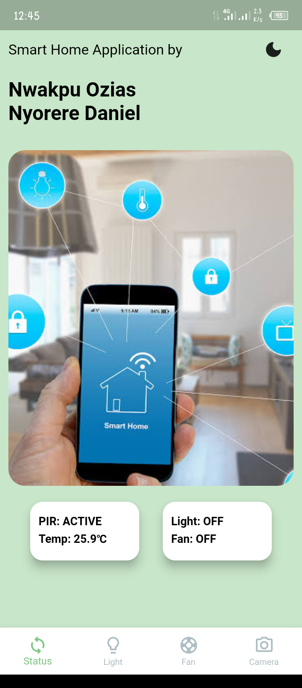
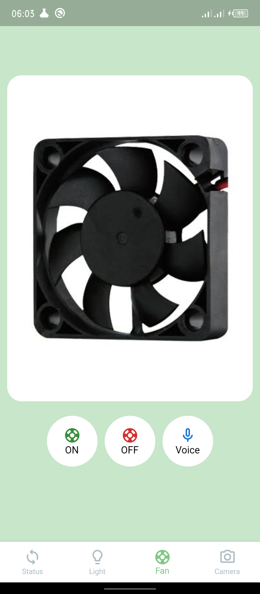

# Smart Home Contol Application

A simple Flutter based mobile application to control and monitor home appliances 
The application was linked with a Firebase Realtime Database to store the current values of the appliances which were then received by a NodeMCU board that does the necessary intended command. It also makes use of webview library to interface and display data gotten from ESP32-CAM.

The application has a different screens such as the Status screen, Fan control screen, Light control screen and the Camera control screen. The application also has speech to text feature which on receiving recognized text relative to the control of the appliances, it sends request to Firebase.

Below are some of the screens.

## Splash Screen

## Login Screen

## Status Screen

## Fan Control Screen

